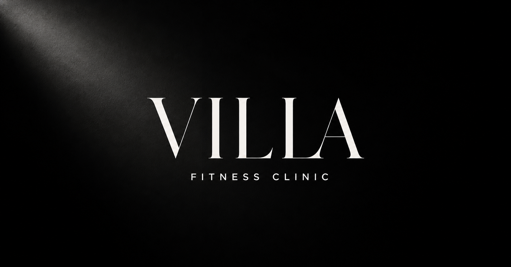

# VILLA Fitness Clinic

[](https://github.com/rodrigoalvesss/villa-fitness-clinic/actions/workflows/ci.yml)

Website oficial da **VILLA Fitness Clinic**, ginásio de treino personalizado localizado no centro de Vila Verde.

**Website:** [villa-fitness-clinic.vercel.app](https://villa-fitness-clinic.vercel.app)

O projeto apresenta o espaço, os serviços e o método de acompanhamento da VILLA através de uma experiência editorial, minimalista e responsiva, com uma identidade visual predominantemente preta e branca.



## Sobre o website

O website foi concebido para transmitir exclusividade, confiança, rigor e acompanhamento próximo, evitando a linguagem visual genérica associada a ginásios convencionais.

Principais características:

- conteúdo integralmente escrito em português europeu;
- navegação adaptada a computador, tablet e telemóvel;
- apresentação de treino personalizado e Pilates acompanhado;
- galeria com fotografias reais do espaço e dos treinos;
- avaliações de clientes provenientes do Google;
- contactos, horário e localização de acesso rápido;
- ligações diretas para WhatsApp, Instagram, Facebook e Google Maps;
- animações subtis e suporte para a preferência de movimento reduzido;
- metadados SEO, Open Graph e dados estruturados `ExerciseGym`;
- favicon e imagem de partilha próprios da marca.

## Páginas

| Rota | Conteúdo |
| --- | --- |
| `/` | Apresentação principal, serviços, método, espaço, avaliações e informações essenciais |
| `/espaco` | Galeria e descrição detalhada do estabelecimento |
| `/servicos` | Treino personalizado, Pilates acompanhado e processo inicial |
| `/contactos` | Morada, horário, contactos e redes sociais |

## Tecnologias

- [Next.js 16](https://nextjs.org/) com App Router
- [React 19](https://react.dev/)
- [TypeScript](https://www.typescriptlang.org/)
- [Tailwind CSS 4](https://tailwindcss.com/) para a base de estilos
- CSS personalizado para o sistema visual, animações e comportamento responsivo
- [React Icons](https://react-icons.github.io/react-icons/) para ícones de interface e redes sociais

## Estrutura do projeto

```text
villa-fitness-clinic/
├── .github/workflows/     # Validação automática no GitHub
├── app/
│   ├── components/        # Componentes partilhados
│   ├── contactos/         # Página de contactos
│   ├── espaco/            # Página do espaço
│   ├── lib/               # Navegação e ligações centrais
│   ├── servicos/          # Página de serviços
│   ├── globals.css        # Sistema visual principal
│   ├── mobile.css         # Otimização responsiva
│   ├── reviews.css        # Estilos das avaliações
│   ├── layout.tsx         # Metadados, estrutura e dados SEO
│   └── page.tsx           # Página inicial
├── public/
│   ├── images/            # Fotografias e logótipos
│   ├── videos/            # Vídeo institucional
│   ├── favicon-villa.png
│   └── og.png             # Imagem de partilha social
├── tests/                 # Testes de navegação e conteúdo renderizado
├── .env.example          # Exemplo da variável do endereço público
├── next.config.ts
├── package.json
└── tsconfig.json
```

## Desenvolvimento local

### Requisitos

- Node.js `22.13.0` ou superior
- npm, incluído com o Node.js

### Instalação

```bash
git clone https://github.com/rodrigoalvesss/villa-fitness-clinic.git
cd villa-fitness-clinic
npm ci
npm run dev
```

O website ficará disponível em [http://127.0.0.1:3000](http://127.0.0.1:3000).

## Comandos disponíveis

| Comando | Finalidade |
| --- | --- |
| `npm run dev` | Inicia o servidor local de desenvolvimento |
| `npm run build` | Cria a versão de produção do website |
| `npm run start` | Inicia localmente a versão de produção |
| `npm run lint` | Analisa a qualidade e consistência do código |
| `npm test` | Constrói o projeto e testa as páginas principais |

## Atualização de conteúdos

- Os contactos e as ligações externas encontram-se em `app/lib/site.tsx`.
- Os metadados, dados estruturados e informação empresarial encontram-se em `app/layout.tsx`.
- Os textos de cada página encontram-se no respetivo ficheiro `page.tsx`.
- As fotografias devem ser colocadas em `public/images/`.
- Os vídeos devem ser colocados em `public/videos/`.

Ao substituir imagens, recomenda-se manter nomes descritivos, comprimir os ficheiros para a Web e confirmar os direitos de utilização.

## Qualidade e validação

O workflow do GitHub Actions executa automaticamente:

1. instalação limpa das dependências;
2. análise estática do código;
3. build de produção;
4. testes HTTP das páginas principais e dos elementos essenciais do negócio.

Esta validação é executada em cada alteração enviada para `main` e em cada pull request dirigido a esse ramo.

## Publicação

O website está publicado na Vercel e ligado a este repositório. Cada atualização validada e enviada para o ramo `main` inicia automaticamente uma nova publicação.

Na plataforma de alojamento, a variável `NEXT_PUBLIC_SITE_URL` deve receber o endereço público completo do website. A associação de um domínio próprio pode ser realizada depois da primeira publicação.

## Informações do negócio

**VILLA Fitness Clinic**<br>
Ginásio de treino personalizado<br>
Rua do Município, 122<br>
4730-760 Vila Verde

- Telefone: [+351 917 616 847](tel:+351917616847)
- Email: [villafitnessclinic@gmail.com](mailto:villafitnessclinic@gmail.com)
- [Instagram](https://www.instagram.com/villa.fitnessclinic/)
- [Facebook](https://www.facebook.com/profile.php?id=61560344797910&locale=pt_PT)
- [Google Maps](https://maps.app.goo.gl/UQCk2FGhSs2j8cccA)

### Horário

- Segunda a sexta-feira: 07:00–21:00
- Sábado: 08:00–13:00
- Domingo: fechado

## Direitos

O código, a identidade visual, as fotografias, os logótipos, o vídeo e os restantes conteúdos deste repositório destinam-se ao website oficial da VILLA Fitness Clinic. Não é concedida uma licença de reutilização, distribuição ou exploração comercial por terceiros.